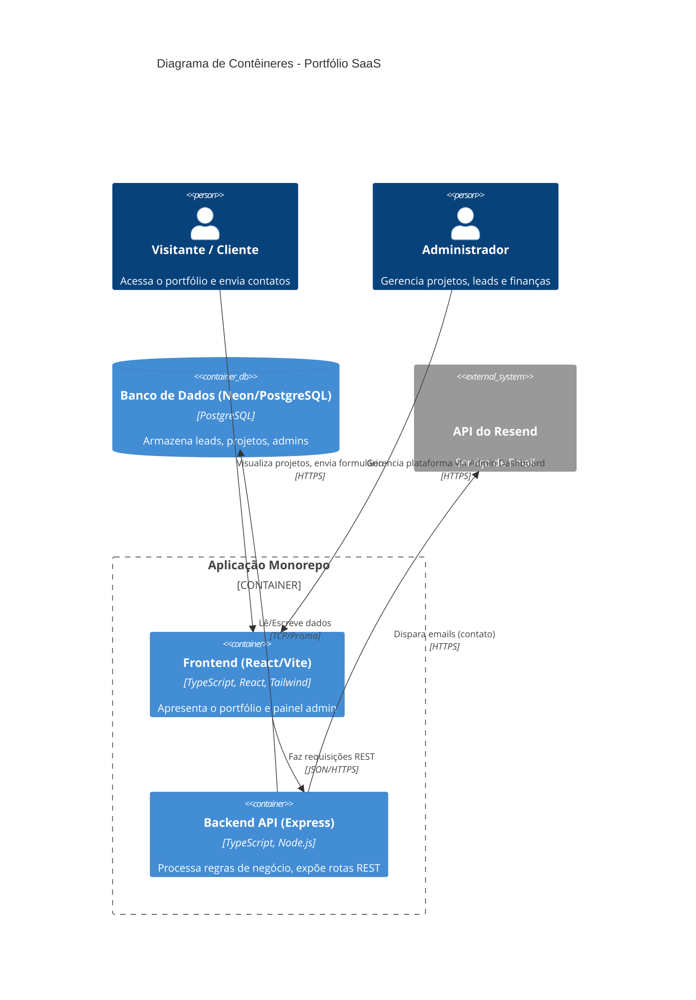

# Arquitetura do Sistema

Este documento descreve a arquitetura de alto nível do Portfólio. O projeto adota uma arquitetura de Monorepo com divisão clara entre o **Frontend** e o **Backend**, focando em escalabilidade, manutenibilidade e performance.

## Visão Geral

O projeto é dividido em dois workspaces principais (definidos no `package.json` raiz):
1. **Frontend**: Aplicação web SPA (Single Page Application).
2. **Backend**: Servidor de API, gerenciamento de banco de dados e integrações.

### 1. Frontend (`/frontend`)
- **Framework**: React.js com Vite para build e desenvolvimento rápido.
- **Linguagem**: TypeScript.
- **Estilização**: Tailwind CSS (utilitários CSS de baixo nível para construção de interfaces customizadas) ou CSS Modules.
- **Gerenciamento de Estado**: React Context / Hooks locais (a definir com base na complexidade).
- **Roteamento**: React Router / TanStack Router.

### 2. Backend (`/backend`)
- **Plataforma**: Node.js.
- **Framework Web**: Express.js, provendo uma API RESTful.
- **Linguagem**: TypeScript.
- **ORM**: Prisma (facilita o mapeamento objeto-relacional e a geração de tipagens seguras).
- **Banco de Dados**: PostgreSQL (gerenciado via Neon).
- **Integrações Externas**: Resend (para envio de emails e notificações).

## 📁 Estrutura de Pastas

A arquitetura do projeto segue uma divisão modular para manter escalabilidade e facilidade de manutenção:

```text
.github/             # Configurações de CI/CD (GitHub Actions)
config/              # Configurações globais
backend/             # Aplicação Node.js / Express
  ├── server/
  │   ├── features/    # Lógica baseada em recursos (projects, auth, etc.)
  │   ├── lib/         # Serviços, integrações e utilitários
  │   ├── middleware/  # Middleware Express
  │   ├── routes/      # Definição de rotas da API REST
  │   └── index.ts     # Ponto de entrada do servidor
  └── prisma/        # Schemas e migrações do banco de dados
frontend/            # Aplicação React / Vite SPA
  ├── src/
  │   ├── features/    # Componentes baseados em recursos
  │   ├── components/  # Componentes globais reutilizáveis
  │   ├── pages/       # Views de página inteira
  │   └── lib/         # Utilitários do frontend
docs/                # Documentação detalhada
scripts/             # Scripts de automação
tests/               # Suíte de testes (unitários, integração, E2E)
```

## Padrões de Design e Decisões

- **Separação de Preocupações (SoC)**: O frontend cuida exclusivamente da camada de apresentação, enquanto o backend orquestra a lógica de negócio e persistência de dados.
- **Padrão Controller / Service**: O backend isola as regras de negócio em arquivos e funções específicas (camada de serviço/lógica) e utiliza Controladores para gerenciar a requisição HTTP.
- **Tipagem Segura (End-to-End Type Safety)**: Utilização do TypeScript em ambos os lados reduz erros em tempo de execução. O Prisma gera os tipos do banco, que podem ser mapeados e validados no Express e compartilhados (quando necessário) com o Frontend.
- **Monorepo**: Facilita a execução local com um único comando (`npm run dev`) e mantém a documentação e histórico do projeto unificados.
- **Env Variables**: Utilização de variáveis de ambiente para isolamento entre desenvolvimento, teste e produção (separação entre `DATABASE_URL` e `DIRECT_URL` para o Neon).

## Diagrama da Arquitetura (C4 Model - Nível de Contêiner)



## Fluxo de Dados (Exemplo: Contato)
1. **Usuário** preenche o formulário no Frontend.
2. **Frontend** envia uma requisição `POST` com o payload via JSON.
3. **Backend (Express)** recebe a requisição, valida os dados (ex: Zod/Joi).
4. **Backend** salva a "Lead/Contato" no banco de dados **PostgreSQL** via **Prisma**.
5. **Backend** chama a API do **Resend** para notificar o administrador.
6. **Backend** retorna `200 OK` (ou `201 Created`) para o Frontend.
7. **Frontend** exibe mensagem de sucesso ao usuário.
